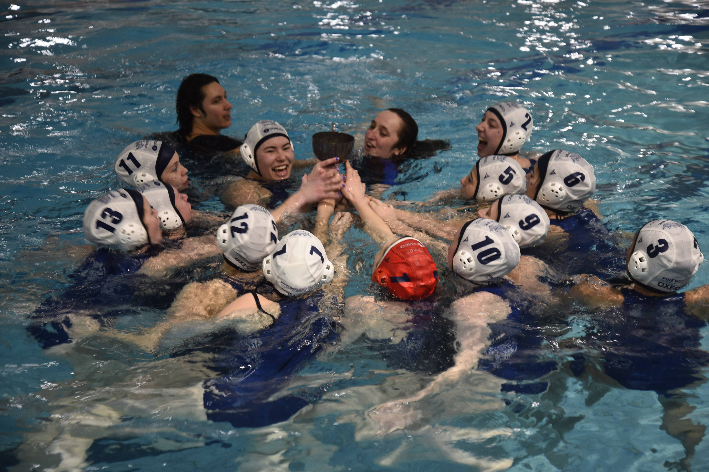

# OUWPC Website — local preview guide

This is a plain HTML/CSS/JS site — no build step, no framework, no install.
Everything you need is already in this folder.

## See it right now in IntelliJ (easiest option for you)

1. Open this whole `ouwpc-site` folder in IntelliJ as a project
   (`File → Open...` → select the `ouwpc-site` folder).
2. In the project tree on the left, find `index.html`.
3. Right-click `index.html` → look for an option like
   **"Open in Browser"** (there are small browser icons in the top-right
   gutter of the editor when a `.html` file is open — click one of those).
   This launches IntelliJ's built-in lightweight web server automatically,
   so internal links between pages (`about.html`, `squads.html`, etc.) and
   the CSS/JS files all work correctly.
4. Your default browser opens to something like
   `http://localhost:63342/ouwpc-site/index.html` — that's your live local
   site. Click around exactly like a visitor would.
5. Edit any file, save, and refresh the browser tab to see changes —
   IntelliJ's server reflects file changes immediately, no restart needed.

> Don't just double-click `index.html` from your file explorer — it'll open
> as a `file://...` path instead of `http://localhost...`, and a couple of
> things (like the mailto contact form's JS) can behave inconsistently
> under `file://`. The IntelliJ browser-preview route above avoids that
> entirely.

## Alternative: plain Python (works outside IntelliJ too)

1. Open a terminal in the `ouwpc-site` folder.
2. Run:
   ```
   python -m http.server
   ```
   (On some systems it's `python3 -m http.server`.)
3. Visit `http://localhost:8000` in your browser.
4. Press `Ctrl+C` in the terminal to stop the server when you're done.

## File structure

```
ouwpc-site/
├── index.html             Home
├── about.html              About the club, yearly schedule, socials, membership, FAQ
├── squads.html              Squad overview — 4 photo-links to squad pages below
├── squads-m1.html            Men's Blues (not in nav — reached via squads.html)
├── squads-w1.html            Women's Blues (not in nav — reached via squads.html)
├── squads-m2.html             Men's Seconds (not in nav — reached via squads.html)
├── squads-w2.html              Women's Seconds (not in nav — reached via squads.html)
├── fixtures.html                Fixtures, results, Varsity
├── committee.html                 Committee photos & contacts
├── gallery.html                    Full photo gallery
├── alumni.html                      Alumni (placeholder — empty for now)
├── join.html                        Contact form (placeholder page otherwise)
├── css/style.css                     All site styling
├── js/main.js                         Mobile nav + slideshow logic
└── images/
    ├── gallery/                        General photos & slideshow images
    ├── team/                            Committee headshots & squad photos
    └── sponsors/                        Sponsor logos (if/when you have any)
```

## Adding your own photos & logos

Every image on the site is just a normal file path — drop a photo into the
right folder with the **exact filename** listed below and it appears
automatically. No code editing required. If a file isn't there yet, the
site shows a clean placeholder instead of a broken image icon, so it never
looks broken while you're still collecting photos.

**Recommended format:** `.jpg`, reasonably compressed (under ~500KB each)
so the site loads fast. Landscape photos work best for slideshows; square
photos work best for the grid sections and squad tiles.

### Homepage (`index.html`)
- `images/team/main-banner.png` — the OUWPC logo/banner in the white top section (use a transparent-background PNG)
- `images/gallery/home-slide-1.jpg` through `home-slide-4.jpg` — main slideshow
- `images/gallery/players-1.jpg` through `players-4.jpg` — "The Club" slideshow
- `images/team/sport-ox-logo.png` — Oxford University Sport logo (affiliate row)
- `images/team/university-ox-logo.png` — University of Oxford logo (affiliate row)

### About (`about.html`)
- `images/gallery/about-1.jpg`
- `images/gallery/about-2.jpg`

### Squads (`squads.html` + squad pages)
- `images/team/squad-m1.jpg` — Men's Blues
- `images/team/squad-w1.jpg` — Women's Blues
- `images/team/squad-m2.jpg` — Men's Seconds
- `images/team/squad-w2.jpg` — Women's Seconds

Each of these photos is also used as the hero image on that squad's own
page (`squads-m1.html` etc.).

### Fixtures (`fixtures.html`)
- `images/gallery/varsity-1.jpg`
- `images/gallery/varsity-2.jpg`

### Gallery (`gallery.html`)
- `images/gallery/feature-1.jpg` through `feature-3.jpg` — large featured slideshow
- `images/gallery/match-1.jpg` through `match-8.jpg` — match-day grid
- `images/gallery/social-1.jpg` through `social-4.jpg` — socials grid

### Footer (every page)
- `images/sponsors/sponsor-1.png` — sponsor logo, links out to their website.
  To change the sponsor or its link, open the footer in any `.html` file,
  search for `pinewood.ai`, and update the `href` and image path. To add a
  second sponsor, copy that whole `<a class="footer-sponsor-link">` block.
- Instagram in the footer links to `https://www.instagram.com/ouwpc/` —
  update this in the same way if the handle ever changes.

### Committee (`committee.html`)
- `images/team/president.jpg`
- `images/team/secretary.jpg`
- `images/team/treasurer.jpg`
- `images/team/social-sec.jpg`
- `images/team/captain-mens.jpg`
- `images/team/captain-womens.jpg`
- `images/team/welfare.jpg`
- `images/team/it-officer.jpg`

### Adding more slides or grid photos
Want another homepage slide, or a 9th match photo? Open the relevant `.html`
file, find a block like this:

```html
<div class="slideshow-slide">
  
  <div class="slideshow-caption">Your caption</div>
</div>
```

...and copy/paste it, changing only the filename and caption. Same idea for
`.photo-cell` blocks in the grid sections.

## What's still placeholder content

Search any file for the class `upload-note` (or just look for the small
dashed boxes on the live pages) — these mark spots with placeholder data
(fixture results, membership socials, squad descriptions, etc.) that your
committee should replace with the real thing before this goes live publicly.

Two pages are intentionally near-empty right now, on request:
- **`join.html`** — has a working contact form, but the "how to join" content
  is still to be decided.
- **`alumni.html`** — placeholder only, content to be added later.

## When you're ready to go live

This local preview is completely independent of the `ouwpc.org` domain
situation. Once you're happy with the content and you've sorted out who
controls the domain (or decided to use a new one), this exact folder of
files gets uploaded to whichever host you choose — no changes needed.
